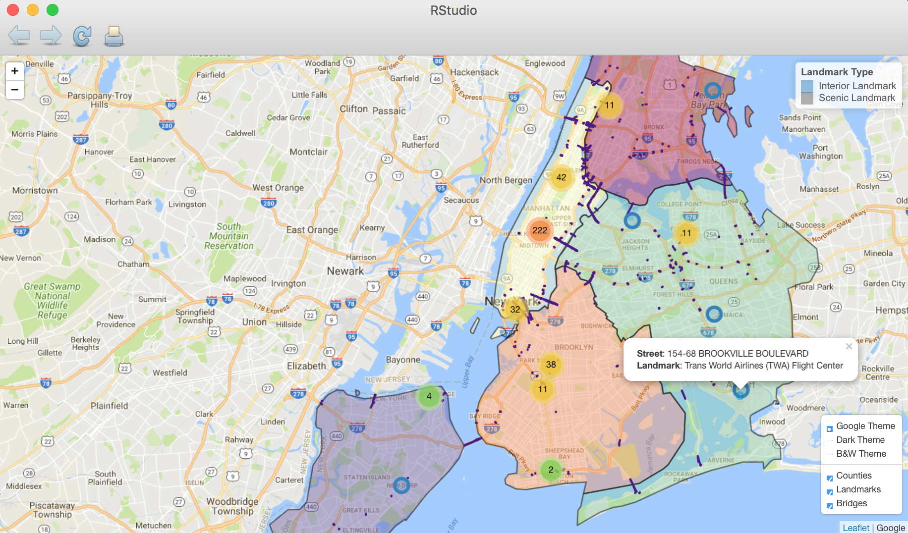

# Homework 3: Leaflet Maps

By: Min Yan BEH (mbeh)

###  Background and Motivation

I'll be bringing a bunch of Singaporean friends around in NYC this Christmas. The question is: 

* Where should I go sightseeing? 
* How can I get around the city?

Hence, I put together a leaflet map with the following layers:

* Polygons that shows the demarcation of NYC counties
* Circle markers that shows interesting landmarks (with popup descriptions, and colored by scenic/interior landmark types with a helpful legend)
* Polylines that show where the bridges are (many of them are scenic, and provide useful routes for circumventing busy roads)

There is also a layer control function that allows toggling of these overlay groups, and allows the user to choose between 3 basemap themes.

###  Finished Output

###  Datasets

Sources: